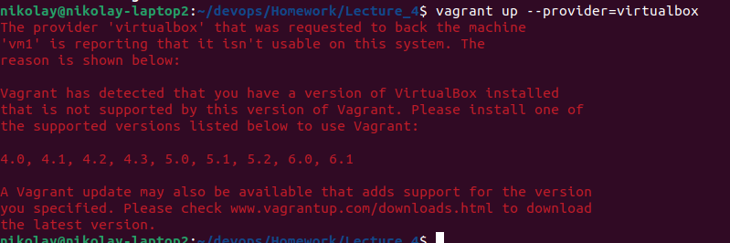
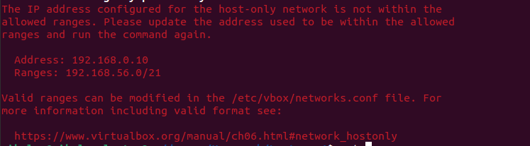
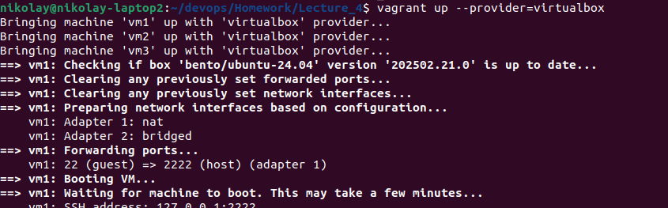

# devops2025

№4. Vagrant

Це було не легко.
В системі вже був ВіртуалБокс, який я встановив до цього через
apt install virtuallbox.

Далі я створив вагрант файл
vagrant init

Модифікував його, додав першу віртуальну машину і запустив:
vagrant up
Bringing machine 'vm1' up with 'libvirt' provider...
Error while connecting to Libvirt: Error making a connection to libvirt URI qemu:///system:
Call to virConnectOpen failed: Failed to connect socket to '/var/run/libvirt/libvirt-sock': No such file or directory

Це непередбачувана помилка, але ЧатГПТ підказав, що треба встановити ліб-вірт
sudo apt update
sudo apt install -y qemu-kvm libvirt-daemon libvirt-daemon-system libvirt-clients bridge-utils

Однією з підказок було - стартонути вагранти саме з віртуальною машиною віртуалбокс:

Тут я зрозумів, що вагрант не сумісний з версією ВіртуалБокс, яка була в системі,
тому він почав використовувати інший тип віртуалки квм.

Далі я видалив існуючий віртуалБокс, та встановив заново за інструкціями з офіційного сайту.

Потім все почало стартувати вже на віртуалбоксі. Проте були деякі проблеми з мережею:

Прийшлось додати bridge в явному вигляді.

Далі всі 3 віртуалки почали нормально запускатись:

Із цікавого - як вагрант розрулює вже існуючий тунель для ссх, перекидаючі на інший порт:

Кінець)
